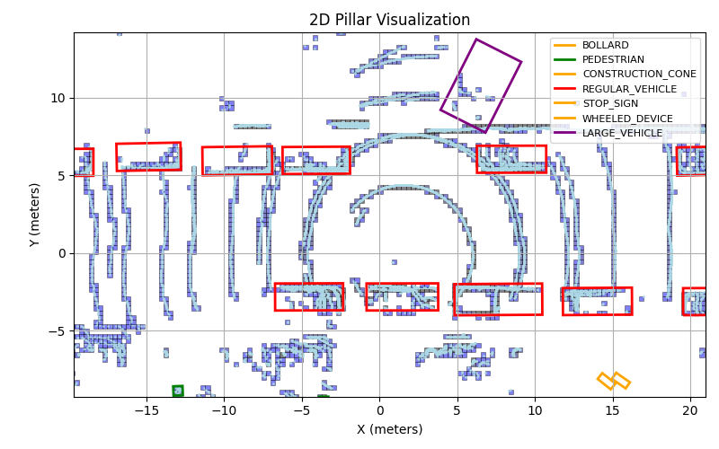

# Single vs. Multi-Modal: A Comparative Analysis of Object Detection Methods in Autonomous Driving

## Table of Contents
1. [Introduction](#introduction)
2. [Dataset](#dataset)
    - [Pre-processing](#pre-processing)
3. [Methodology](#methodology)
    - [Single-Modal](#single-modal)
        - [PointPillars (LiDAR Only)](#pointpillars-lidar-only)
    - [Multi-Modal](#multi-modal)
        - [PointFusion (Early Fusion)](#pointfusion-early-fusion)
        - [MVX-Net (Mid Fusion)](#mvx-net-mid-fusion)
        - [AVOD (Late Fusion)](#avod-late-fusion)


## Introduction
This project compares single-modal and multi-modal object detection methods for autonomous driving using the Argoverse2 dataset. It evaluates how well LiDAR-only, and fused sensor approaches (via early, mid, and late fusion strategies) detect objects like vehicles and pedestrians in diverse urban conditions. By using models such as PointPillars for LiDAR and fusion methods like PointFusion, MVX-Net, and AVOD, the study aims to quantify differences in accuracy, robustness, and inference speed, offering insights into effective sensor fusion strategies for safer autonomous systems.

## Dataset
The Argoverse2 sensor dataset is a large-scale dataset designed for autonomous driving research. It includes high-resolution sensor data from various modalities, including LiDAR and cameras, collected in diverse urban environments.

[Argoverse 2 Link](https://www.argoverse.org/av2.html)

Due to the size of the original dataset (1TB), this study will use a subset of the Argoverse2 dataset, specifically 5% of the data (41,2 GB), which is split into 28 training sequences and 7 test sequences.

To download the dataset, you can use the following command:

```bash
./scripts/download_dataset.sh
```


<details>
<summary>Permission Settings</summary>

If you encounter permission issues when running the script, you can edit permissions using the command:

```bash
chmod +x ./scripts/download_data.sh
```
</details>


### Dataset Structure:

```
├── data
│   ├── train
│   │   ├── 0a8a4cfa-4902-3a76-8301-08698d6290a2
│   │   │   ├── calibration
│   │   │   ├── sensors
│   │   │   │   ├── lidar
│   │   │   │   │   ├── 315968251560183000.feather
│   │   │   │   ├── cameras
│   │   │   │   │   ├── ring_front_center
│   │   │   │   │   │   ├── 315968251549927220.jpg
│   │   │   │   │   │   ├── ...
│   │   │   │   │   ├── ring_front_left
│   │   │   │   │   ├── ring_front_right
│   │   │   │   │   ├── ring_rear_left
│   │   │   │   │   ├── ring_rear_right
│   │   │   │   │   ├── ring_side_left
│   │   │   │   │   ├── ring_side_right
│   │   │   ├── annotations.feather
│   │   │   ├── ...
│   ├── test
│   │   ├── ...
```

### Pre-processing
The dataset is pre-processed to extract relevant features and annotations for training and evaluation. The pre-processing steps include:


## Methodology
### Single-Modal:
#### PointPillars (LiDAR Only)
PointPillars is a state of the art LiDAR-based object detection model that uses a unique pillar-based representation of point clouds. 

##### Pre-processing
- **Voxelization**: The point cloud is divided into pillars (2D grid cells) of fixed size (e.g., 0.3m x 0.3m)
- **Feature Extraction**: Each pillar is represented by a fixed number of points (e.g., 100). Maximum amount of pillars per frame is fixed (e.g., 12000).
    - In case of more or less pillars or points, the data is padded or truncated.

The features for each point include:
- (x, y, z): 3D coordinates
- intensity: LiDAR intensity value
- (x_c, y_c, z_c): center coordinates of the pillar
- (x_p, y_p): normalized coordinates of the point within the pillar

<!-- Add image here -->
<!--  -->
<p align="center">
    
    <br>
    Example of voxelizated point cloud with pillars, point and annotations
</p>

##### Architecture
1. Pillar Feature Encoder (PillarFeatureNet)
   - Input: [P, N, 9]
     - P: number of non-empty pillars
     - N: number of points per pillar (fixed, e.g. 100)
     - 9 features per point: [x, y, z, intensity, x_c, y_c, z_c, x_p, y_p]
   - Output: [P, C]
     - A feature vector per pillar (typically C = 64)

2. Pseudo-Image Scattering
   - Each pillar feature is placed into its (x_idx, y_idx) location in a 2D canvas of shape [C, H, W]
   - Uses `coords = [batch_idx, x_idx, y_idx]` to determine location

3. 2D CNN Backbone (Backbone2D)
   - Takes the pseudo-image [B, C, H, W]
   - Applies convolutional layers (with strides) followed by deconvolutions
   - Produces a high-level spatial feature map: [B, 6C, H, W]

4. SSD Detection Head (SSDDetectionHead)
   - Operates on the output of the 2D backbone
   - Predicts:
     - Class scores: [num_anchors * num_classes]
     - Box regression: [num_anchors * 7] → (x, y, z, w, l, h, θ)
     - Orientation classification: [num_anchors * 2]

##### Key Files
- `/src/loaders/loader_Point_Pillars.py`: Handles the data loading and preprocessing for PointPillars, including the pillarization process
- `/src/utils/visualization/pillars.py`: Provides visualization tools for the pillarized point clouds and detection results
- `/src/models/PointPillars.py`: Will contain the model architecture implementation (currently empty, to be implemented)
- `/scripts/run_train_pointpillars.sh`: Will be used for training the PointPillars model (currently empty, to be implemented)


### Multi-Modal
#### PointFusion (Early Fusion)

#### MVX-Net (Mid Fusion)

#### AVOD (Late Fusion)
